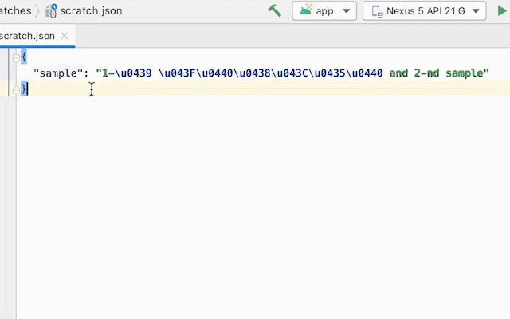

Unicode Escaper
===============

Transform non ASCII subset of Unicode characters to escaped UTF-16 and vice versa.

Additional Links
----------------
- [ASCII Escaping of Unicode Characters](https://tools.ietf.org/pdf/bcp137.pdf)
- [Unicode and Character Sets Explained](https://www.joelonsoftware.com/2003/10/08/the-absolute-minimum-every-software-developer-absolutely-positively-must-know-about-unicode-and-character-sets-no-excuses/)
